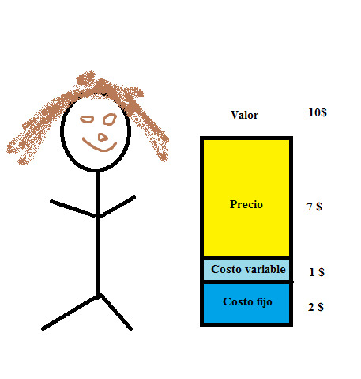
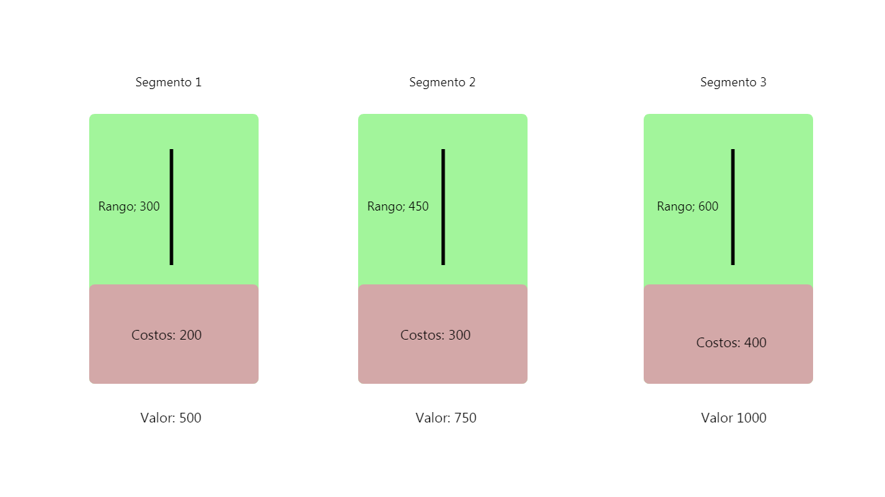

Creo que existe poca información en español acerca de los sistemas de precio y su verdadero poder. No es raro ver un mal precio, uno al que se le escapan oportunidades de crecimiento. De hecho, una práctica común y uno de los motivos que –eventualmente- provocan un nulo crecimiento y una incapacidad para re-invertir el valor es un mal precio.

El precio no es más que una estructura dinamica donde coexisten elementos, y entenderlos es fundamnetal si queremos crecer. En este primer ensayo quiero explicar lo que es el valor y su relación con las estructuras de precios. 

---

> ### **Definiendo el valor** 

El significado de valor se ha tratado de explicar a través de la economía. Existen dos grandes pensamientos; el primero -y más antiguo- es el pensamiento económico clásico donde se propuso la teoría del valor-trabajo y que sostiene que el valor de un producto depende de los esfuerzos (costos) con los que se construyó dicho producto. En otras palabras; **a mayor esfuerzo, mayor es el precio.**

A mediados del siglo XIX nace una respuesta de la mano del pensamiento austriaco y la teoría del valor subjetivo. Esta teoría sostiene que **el valor de una mercancía no depende de los esfuerzos, sino de la utilidad que brinda al individuo**. Es decir, el valor es subjetivo para las personas. Quedense con lo anterior pues esta es la base de la fijación de precios. Carl Menger lo explica muy bien:

> “La subjetividad es la percepción y valorización personal y parcial sobre un asunto, idea, pensamiento o cultura. La subjetividad se asocia a la incorporación de emociones y sentimientos al expresar ideas, pensamientos o percepciones sobre objetos, experiencias, fenómenos o personas. El valor de los bienes por lo tanto es subjetivo y se fundamenta en la relación de los bienes con nuestras necesidades, no en los bienes mismos. Según varíen las circunstancias, puede modificarse también, aparecer o desaparecer el valor.”

En pocas palabras, **el precio se pregunta, no se coloca**.

--- 

Para explicar todo lo anterior, tengo un ejemplo sencillo:

Imagina que quieres abrír un restaurante y desarrollas un estudio para averiguar el valor que percibe tu segmento. Digamos que tu segmento está dispuesto a pagar un valor de 10$ por platillo, lo que te da un rango con un mínimo de 0$ y un máximo de 10$.

Imaginemos que sumando costos fijos y variables, en promedio te costaría producir 3$ cada platillo. Esto te da un rango de 7$ donde puedes colocar el precio que desees. 

Todo el rectangulo que ves en la imagen anterior, desde el costo fijo hasta el precio, está dentro del valor que tu segmento está dispuesto a pagar por tu producto. 

Interesante, ¿no? Esto es practicamente un "nuevo" paradigma para diseñar un sistema de precios. Empresas en fase de market fit se preocupan primero por la aceptación del producto y despues por como monetizarlo. 

Preguntar, entender y visualizar el rango de valor te permite construir un producto respetando la percepción de tu segmento, y su disponibilidad de pago con el proposito de obtener ganancias que te permitan seguir reinvertiendo y por consecuente, seguir generando valor. El propósito de una compañía es mantener ese valor, encontrar más valor (a través de acciones o nuevos productos) y seguir rascando esa “subjetividad” de mercado que les ayude a crecer.

Creo que hemos aterrizado con éxito el concepto de valor. Podemos concluir con que es un approach interesante para construir productos a partir de la subjetividad del producto para con el mercado.

La idea del siguiente bloque es explicar el approach de estructuras para que se entiendan los elementos que coexisten dentro del precio y que son los costos variables, costos fijos, estrategia, disponibilidad de pago, etc.

> ### **Estructura de precios**

El precio es el monto que esperas recibir por el producto que vendes, ese monto suele ser representado por unidades monetarias pero en algunas partes puede ser representado por cabezas de ganado.

A su vez, la estructura de precios es un enfoque que muestra la relación entre tu fijación de precios y tu producto. La estructura abarca 4 elementos:

##### Características  

* El trabajo de las características es averiguar que quiere tu segmento de mercado y cuantos tipos de clientes tienes ahí. Con esa información puedes empaquetar tu oferta acorde a las necesidades específicas de cada uno de las personas del segmento.

##### Valor

* El trabajo del valor es averiguar cómo te perciben y su disponibilidad de pago.

##### Costos 

* El trabajo de los costos es saber cuánto te va costar conseguir ese valor y si es factible perseguirlo.

##### Precios

* El trabajo del precio es colocar el monto adecuado basandote en la información de los elementos anteriores.

La estructura no es solamente un esquema que te muestra la dinámica de tus elementos y su relación. También cumple con propósitos de flexibilidad, escalabilidad y crecimiento. 

**Flexibilidad**.- Es la parte que te permite implementar cursos de acción relacionadas con tu objetivo. Este objetivo puede ser el penetrar un mercado o el obtener más ganancias. Recuerda que si tu objetivo cambia, también lo hace tu estructura (por ello se necesita de flexibilidad).

**Escalabilidad**.- Es la parte que está compuesta por dos cosas; la primera es que a medida de que crezcas, tus costes no superen tus precios. La segunda es que el crecimiento no afecte tu precio y te permita obtener una ganancia (del valor) que puedes reinvertir en tu organización.

**Crecimiento**.- El enfoque del crecimiento es el jugar con tu precio, es la parte que te permite empaquetar tu producto para llegar a más consumidores. Aquí puedes probar ofertas o implementar descuentos que sin sacrificar crecimiento.

**La estructura y sus propósitos** te ayudan a  responden esta clase de preguntas:

* ¿Qué descuentos puedo ofrecer?
* ¿Cómo puedo mejorar mi modelo de negocio?
* ¿Qué puedo hacer para entrar a x mercado?
* ¿Qué acciones puedo tomar sin afectar mis finanzas de forma negativa?

Es un framework super util y que debemos si o si tomar en cuenta a la hora de crear nuestro producto o añadir nuevos features. Voy a profundizar añadiendo un ejemplo.

Imagina que tienes una empresa que ofrece masajes y deduces que existen tres personas en tu segmento:

1. Los que solo quieren un masaje.
2. Los que quieren un masaje y aromaterapia.
3. Los que quieren masaje, aromaterapia y un baño. 

Lo que esta en la parte de abajo es el valor que promedio que capturaste al recabar información. Ese es el rango en el que tienes permitido jugar.

Lo que está en café son tus costos por masaje. Antes de eso pierdes dinero (suponiendo un break even), después de eso ganas dinero.

Lo que está en verde es todo el espacio con el puedes jugar para colocar un precio. Cada feature tiene un rango y unos costos diferentes, la razón es que el valor aumenta dependiendo la subjetividad de tu segmento. Características —> Valor —> Costos. Es hora de abarcar un poco en el tema de precios.

> ### **Estrategia de precios** 

La estrategia de precios es la fijación de un monto puramente enfocado al mercado, y complementa la estructura de precios. Ayuda al empaquetado, colocación de ofertas y descuentos. Siempre tomando en cuenta el contexto de tu empresa y necesidades del cliente. Algunos ejemplos son:

> #### **Precios singulares/de tarifa plana**

Estas son las estructuras donde se establece solo un precio, por lo regular sirven a un tipo de cliente específico. Aunque sean estructuras basadas en un solo precio, no significa que el precio deba ser estático, siempre puede actualizarse dependiendo la dinámica del mercado (clientes/competidores)

En estos momentos Amazon Prime se encuentra penetrando el mercado de México, la idea es generar una base que sea leal y después moverse a la siguiente etapa. Se trata de Amazon usando su musculo financiero, esto significa un beneficio (por tu parte) de su oferta por un periodo de tiempo. Esto crea la “dependencia” necesaria para poder aumentar los precios y disminuir tu sensibilidad así como aumentar tu tolerancia a los cambios. 

> #### **Precio con múltiples opciones**

Su nombre lo dice, es la estructura que ofrece múltiples opciones para diferentes tipos de segmentos. Es una estructura exitosa en los modelos de suscripción, y la más regular. Por cierto, aquí estaba lo que comentaba en el punto anterior. En Estados Unidos ya se encuentran en múltiples opciones. Es más complejo de lo que escribo aquí pero el ejemplo es para dar una idea de las estrategias, no para desestructurar todo el long-term price de Jeff Bezos.

> #### **Precios variables**

La estrategia de precios variables responde al volumen de compra o tráfico que manejes. Por lo regular, estos precios vienen acompañados de equipos de venta y soporte con los que hablas para que ellos te ofrezcan algo acorde a tus necesidades y volúmenes.

> #### **Precios por usuario**

Esta estructura hace referencia al cobro por cantidad de usuario agregados a un plan. Se da en empresas que venden software como servicio pero enfocadas a equipos de trabajo. Notion es un ejemplo de ello, después de ciertos usuarios empieza a cobrarte una tarifa.

Se puede implementar más de una estrategia por empresa, muchas empresas lo hacen. Pero eso no significa que tú lo debas hacer, la estructura cambia dependiendo el objetivo de la empresa. Te recomiendo leer los otros post ya que profundizo sobre este complejo tema. La idea de esta publicación es aterrizar el valor, la estructura y la estrategia de precios. Sin lo anterior es difícil entender el proceso de fijación de precios.

Por ultimo, te dejo una ultima cita de Patrick Campbell, CEO de ProfitWell:

> Toda estructura de precios comienza con un objetivo de precios. Cambie el objetivo, y tendrá que cambiar la estructura también. Ya sea que intente entrar en un campo competitivo, vendiendo un producto de alto valor y/o muy innovador, atendiendo a una amplia gama de compradores o jugando en un campo estrecho, adapte su estructura de precios en consecuencia.

Nos vemos en la siguiente entrega. ¡Un abrazo y gracias por leer!