Si nos ponemos filosoficos, podriamos decir que el costo es aquello que entregamos a modo de inversión y -a su vez- es una acción que busca un objetivo particular. Para las empresas ese objetivo puede ser fabricar un bien, ofrecer un servicio, costear acciones para comercializar su producto por canales como publicidad digital o bien puede ser el desarrollar ese producto desde ingeniería. Por lo tanto, el costo es el sacrificio que hacemos por el valor que tanto anhelamos y perseguimos.

En este articulo aprenderas sobre:

* ###### Que es una estructura de costos
* ###### Como se clasifican los costos
* ###### Como se comportan los costos
* ###### Como identificas los costos 
* ###### Que son los cost drivers 
* ###### Casos reales de Shopify y Apple

Todos estos ejemplos los contextualizo con el caso de una startup. ¡Espero disfrutes el articulo!

> #### **Estructura de costos**

Una estructura de costos se refiere a la organización y relacion de un conjunto de distintos tipos de costos. La idea detrás de entender esta estructura es obtener una –macro perspectiva- que permita contextualizar la dinámica de tus costos, y con ello poder comparar (interna o externamente), optimizar y/o entender donde estas fallando.

> Ejemplo

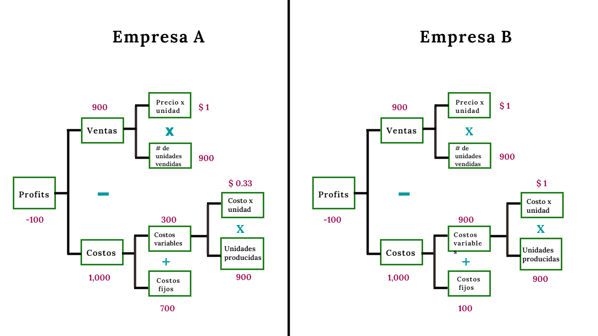

Este framework se llama "profitability framework" y es una manera de estructurar el como una empresa hace dinero. En este caso queremos comprender la mecánica dentro de los costos y la diferencia entre una empresa y otra.

Supongamos que la única información que tenemos es que la empresa A y B compiten en el mismo sector y se dedican a comercializar chiles enlatados.

Estas son las que puedo deducir al ver cada estructura: 

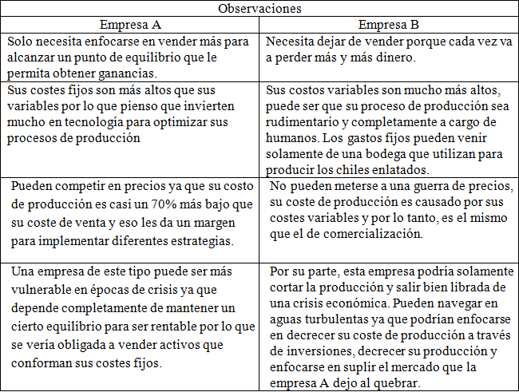

Uno de los poderes de estructurar la dinamica dentro de tu organizacón es ponerte en contexto, y creeme, el contexto es preciado al momento de tomar decisiones. 

> #### **Clasificación de costos** 

Como viste en el ejemplo de la estructura, los costos se clasifican. La parte de costos esta conformada por dos grandes bloques: 

* ##### Los costos variables. 
Estos costos estan relacionados directamente con la producción-demanda de un bien, es decir, estos aumentan o disminuyen dependiendo la interacción del mercado para con el producto. 

* ##### Los costos fijos. 
Estos costos son independientes de la producción y suelen ser estáticos hasta cierto volumen. Por ejemplo, el costo fijo puede aumentar si el límite de producción por m2 es superada, en casos como este se podría necesitar otro edificio para fabricar el producto en cuestión.

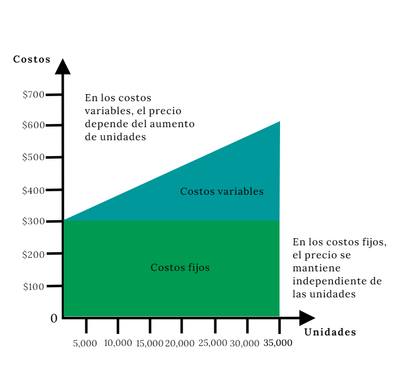

> #### **El comportamiento de los costos** 

Si, los costos tienen comportamiento. Suelen saltarse algunas reglas -generalmente conocidas- como la perfecta correlacion de crecimiento entre el costo variable y la producción o la independencia y estabilidad del costo fijo para con la producción.

> ##### Los 4 comportamientos 

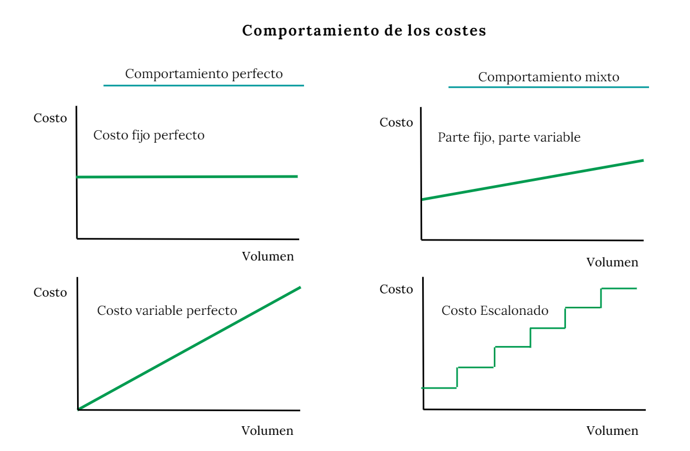

Voy a ejemplificar uno de estos costos para que puedas entenderlos mejor. 

*Piensa en un equipo de servicio al cliente.* Un equipo de este tipo tiene cierta capacidad para atender a un determinado numero de clientes, puedes contar con 5 personas para atender 100 dudas a la semana, si esas dudas crecen a 200 semanales probablemente necesitas adherir más personas.

##### **¿Como clasificarías este costo?** 

No podrías ponerlo en variable o en fijo, el comportamiento no es perfecto y tampoco depende enteramente de una producción. Pero si lo piensas bien, parece algo escalonado. Nuevos trabajadores ocupan un nuevo espacio fijo durante un tiempo (que se mantiene hasta no adherir más personas), o sea, un costo que se vuelve plano en una parte y despues aumenta y sigue así el mismo ciclo. ¿Por que? Porque durante un periodo de tiempo añades personas a un lugar lo que te da una temporada de costos fijos pero luego las llamadas aumentan y eso te hace aumentar el personal lo que escala el costo. 

Tranqui, no hace falta que te rompas la cabeza con el comportamiento. Existe un método que nos puede ayudar a medir con mayor exactitud.

> #### **Identificación de costos** 

Para identificar tus costos necesitas tres cosas: 

1. Conocer tu negocio y entender a dónde quieres llegar.
2. Plasmar y estructurar una estrategia que te ayude a llegar a donde quieres.
3. Identificar los procesos y drivers que afectaran esa estructura.

En esta parte abordare un ejemplo para dejar todo mas claro.

Imagina que detectaste una fricción en el sector logístico, más en específico en el mercado de envíos nacionales por carretera. Lo que encontraste es que las empresas logísticas no aprovechan eficientemente sus recursos. En muchas palabras, los transportistas realizan viajes con mercancía que descargan en ciertos puertos de tú país pero regresan a su HUB de origen sin cargamento, o sea que desaprovechan ese viaje de retorno pudiendo traer mercancía.

Ahora que eres consciente del problema, queda crear un producto que le permita a los transportistas o empresas logísticas el emparejarse con personas que quieran enviar cargas al lugar de origen de los transportistas para así aprovechar el viaje de regreso.

El valor detrás de este producto es incrementar la rentabilidad de los transportistas optimizando su viaje de regreso. 

En este punto te toca entender cuáles son los costes de crear esta estructura. Este ejemplo se encuentra en una etapa temprana, por lo tanto el dilema del huevo y la gallina sería un escenario esperado. El dilema significa que tienes que tomar una decisión acerca de si atraer primero a tu oferta (transportistas) o atraer primero a tus consumidores (personas que necesitan un transporte de mercancía).

Digamos que haces lo mismo que el 99% de los mercados digitales. Por lo tanto, tu primer paso es enfocarte en conductores y después en los consumidores -al mismo tiempo que desarrollas tu producto-.

Hasta ahora hemos entendido a donde queremos llegar y cuál es nuestra estrategia. Sigamos con el ejemplo.

> #### **Entendiendo la estructura** 

Creo que las actividades clave de nuestra estrategia son Growth y Producto. Necesitamos no solo atraer personas, sino que también necesitamos desarrollar el producto acorde a las necesidades de nuestro segmento.

Para este caso vamos a utilizar el approach estrategia-estructura para poner en contexto acerca de la dinamica dentro de la estructura. Esto nos ayuda a contestar preguntas como ¿Cuanto nos costara perseguir ese valor del que tanto hablamos en la [parte 1](https://joseluistello.live/estructura-de-costos)? Y que profundizamos en la [parte 3](https://joseluistello.live/fijacion-de-precios) 😉

Siguiendo con el ejemplo. Esto podemos identificar como los costos de la idea:

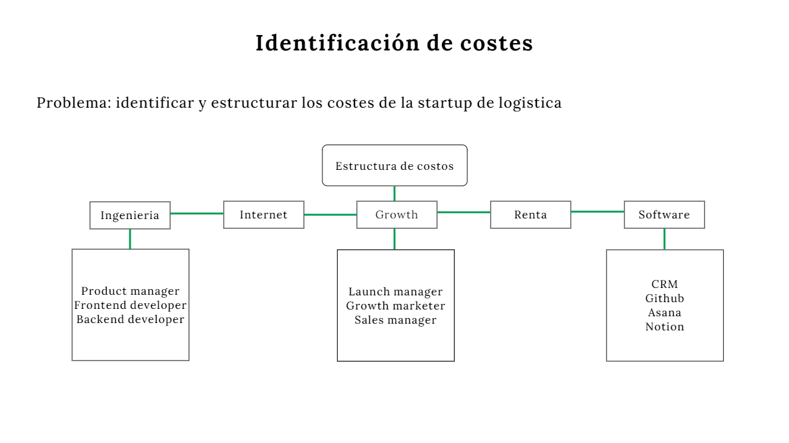

Como lo mencione anteriormente, necesitamos de ingeniería y de growth. Puedes ir tan profundo como quieras con tal de entender e identificar tus costos, -tanto en este como en el siguiente apartado-.

Listo, ahora terminamos el ejemplo de identificación. Aprender a detectar los costos cruciales dentro de tu idea es fundamental para que entiendas donde debes poner tu tiempo y dinero, porque recuerda; los costos no son solo dinero. Es tiempo de profundizar en la identificación.

> #### **Cost Drivers** 

Una vez identificados, es tiempo de entender aquello que los detona.

Un cost driver puede ser definido como la unidad que altera nuestros costos, estas alteraciones pueden significar en un aumento o disminución de precio. En una viga de acero; un cost driver puede ser lo largo de la viga o el peso de la misma. Pero dentro de nuestro ejemplo, el cost driver de un desarrollador frontend puede ser lo siguiente:

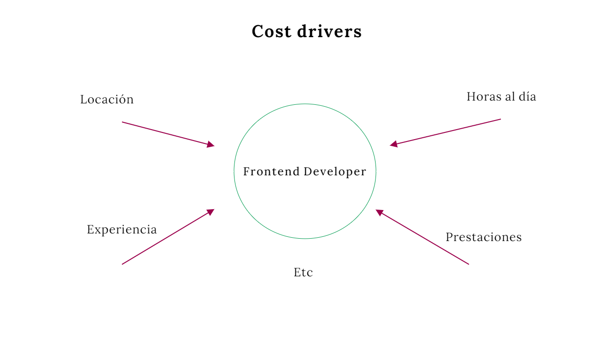

* La experiencia determina el sueldo
* Las horas al día determina cuanto costara el recurso humano dentro de un determinado periodo de tiempo 
* La locación puede ser otro factor ya que tal vez necesita trasladarse a las oficinas centrales 

Interesante approach, ¿cierto? Ahora es tu turno de desarrollar tu estructura, puedes ir tan profundo como tu quieras.

#### ¡Antes de que te vayas!

Tengo unos ejemplos que te van a encantar.

> #### El caso Shopify y Apple

En esta parte hablaremos de un caso especial, en pocas palabras quiero mostrarte la correlación que existe entre los costos y las ventas de una empresa.

Antes de empezar quiero aclarar ciertos terminos:

> Un modelo (ya sea estadístico o financiero) busca modelar la realidad a traves del analisis de datos. Este analisis se hace con una serie de técnicas que tienen el objetivo de ayudarnos a entender el fenomeno de nuestro interes. 

En este caso usaremos un modelo financiero y un modelo de regresion lineal los cuales nos ayudaran a capturar datos y entender la relación entre dos variables, en este caso, ventas y costos.
 
> #### **Empecemos** 

Primero capture los datos de los estados de resultado de Spotify durante 12 trimestres, empezando por el 2017. 

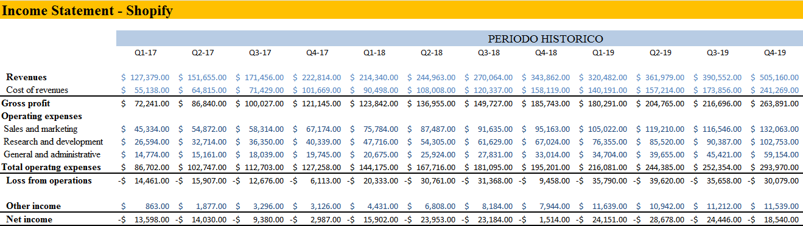

Con este modelo financiero obtuve distintas variables que sometí a un estudio de correlación:

> **Sales and marketing vs Revenue** 

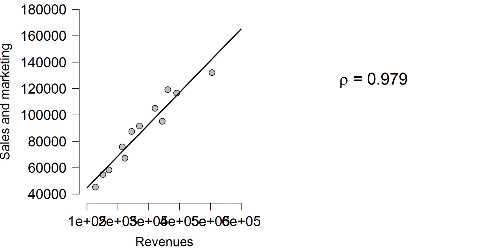

> **Research and development vs Revenue** 

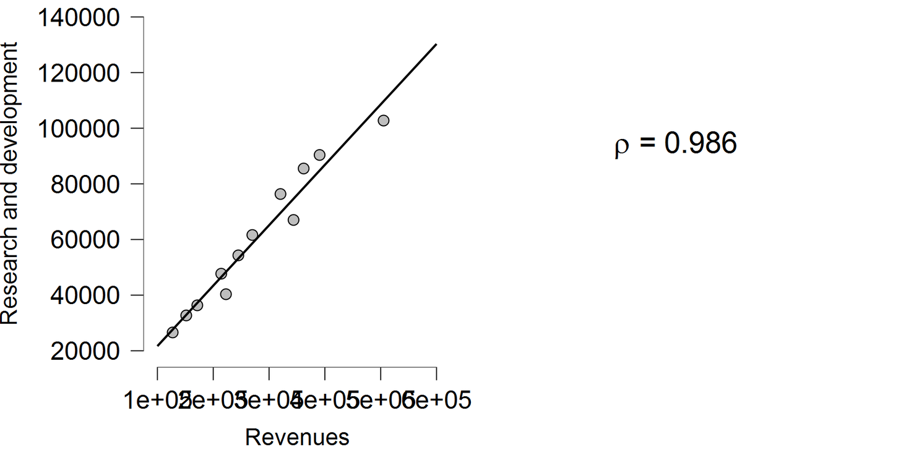

> **Total Operating Expenses vs Revenue**

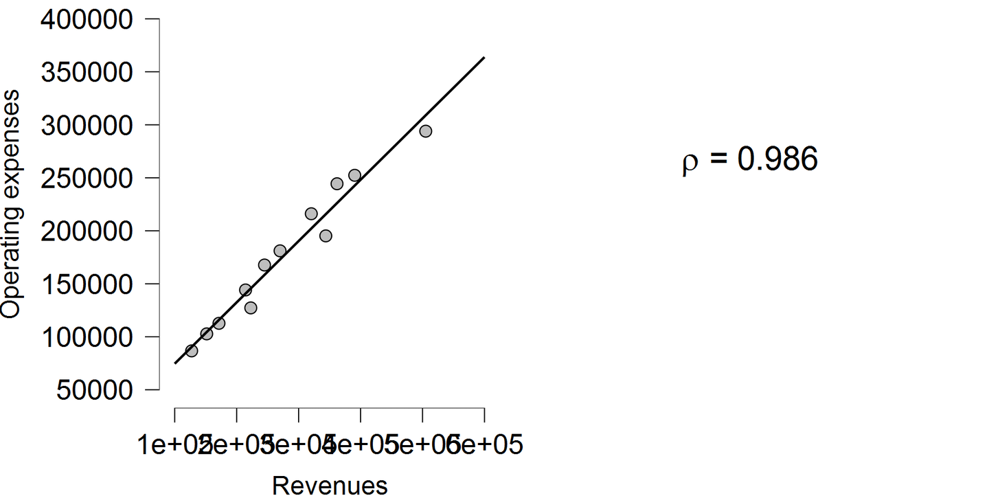

Podemos ver como hay una fuerte relación entre cualquier tipo de costo y el revenue de la empresa. No importa si es operaciones o investigación y desarrollo, la relacion esta ahí pero recuerda; *identifica lo que trae valor y no pongas el dinero donde solo lo desperdicias*.  

Y si todavía tienes dudas, [aquí te dejo](https://github.com/joseluistello/Regression-Analysis-Apple-Data) un link hacia el modelo que hice con Python para determinar la correlacion entre los costos de Apple y su revenue con datos historicos desde el dia que Apple salio a la bolsa. Este es uno de los plots donde en el vertical Y tenemos los miles de millones y en el X los años:

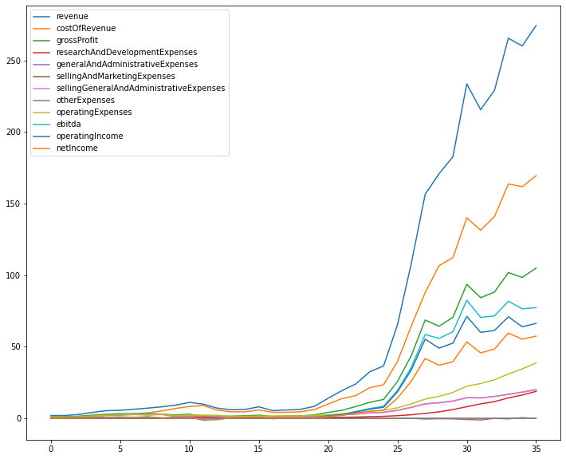

> #### **En conclusión**

Estructura, identifica y prioriza. Esto es lo adecuado. Un costo es el sacrificio que hacemos para perseguir el valor que tanto anhelamos y creo que no quieres sacrificar algo en vano.

En la [primera parte](https://joseluistello.live/una-introduccion-al-valor-y-las-estructuras-de-precios) hablamos sobre el valor, en esta segunda parte entendimos el mundo de los costos y en la [tercera](https://joseluistello.live/fijacion-de-precios) (y ultima) [parte](https://joseluistello.live/fijacion-de-precios) escribi sobre como fijar un precio. Espero vayas a leerlo.

Hasta la próxima y muchas gracias por leer. No olvides suscribirte a mi [newsletter](https://simplificandola.substack.com/about?utm_source=menu-dropdown).

