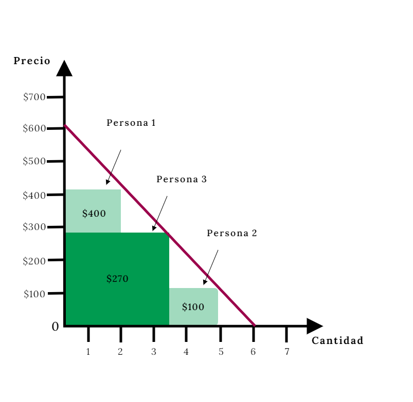
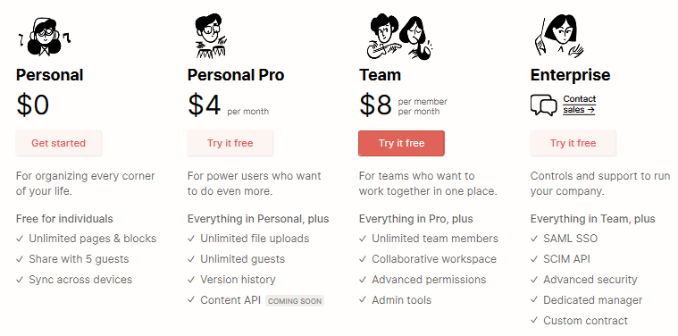
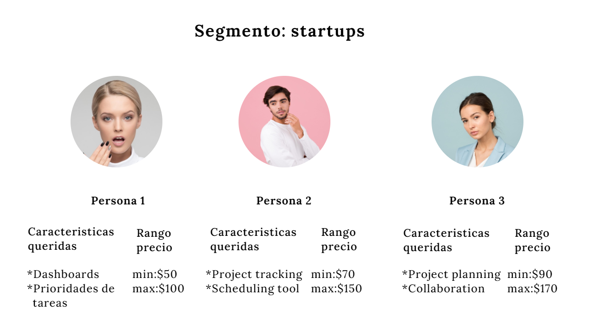
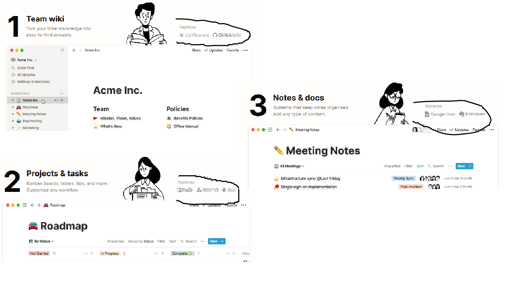
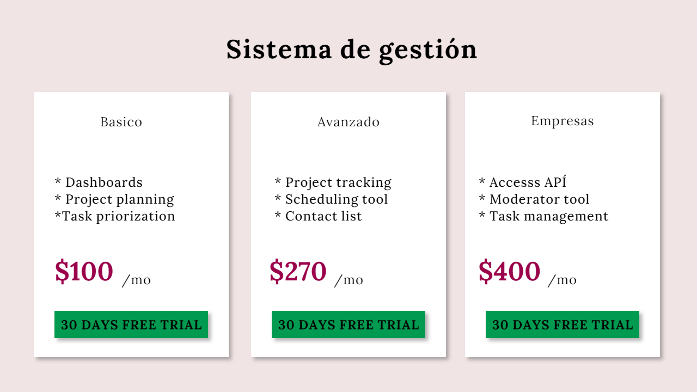

Lo dijo Charles Darwin hace 200 años

> No es el más fuerte de las especies el que sobrevive, tampoco es el más inteligente el que sobrevive. Es aquel que es más adaptable al cambio. 

Las empresas no son diferentes a los organismos, de hecho, las empresas (tecnicamente hablando) son organismos. Ellas también aprenden y evolucionan a su entorno, y es en el papel de la adaptabilidad en el que podemos encontrar a la fijación de precio. 

> #### **La importancia de fijar el precio correcto.**

Mi título es engañoso, no existe como tal -el precio definitivo- pero lo que sí existe es el precio correcto por periodos de tiempo. Me explico:

El precio es el resultado de una constante experimentación que –supone- debe hacerse cada cierto tiempo. La razón de experimentar por  periodos de tiempo se debe a los distintos cambios a los que se somete una empresa. Uno de estos cambios puede ser el adherir más características, otro de ellos es encontrar nuevos usos para el producto, nuevos segmentos, etc. Esto significa que la percepción del valor del cliente cambia y como lo vimos en la primera entrada, mayor valor es igual a mayor rango de precio lo que te da más libertad para mover tu precio. Al final del día, el precio puede ser una manera de ayudarnos con lo siguiente:

* Mayor adquisición
* Mayor retención = más dinero
* Mayor Annual recurring revenue
* Mayor Average revenue per user
* Más flexibilidad para  modificar el modelo de negocio

> #### **¿Cómo fijamos un precio adecuado?**

La fijación es básicamente un proceso que busca profundizar en 3 aspectos:

* Qué problema solucionamos
* El segmento al que apuntamos y sus características
* Que quieren las personas de ese segmento y cuanto están dispuestos a pagar por tu producto 

> ### **Empecemos por el problema**

Imaginemos una empresa donde habitan 5 personas que eventualmente se vuelven 30 a final de año. El shit show empieza a manifestarse dentro de este ente, más personas es igual a más procesos, más procesos es igual a más reportes, más reportes es igual a más documentación lo que da por resultado más y más complejidad. En este punto la empresa comienza a detectar sintomas y encuentra que sus procesos se vuelven tediosos, que la documentación no se entrega y que los reportes no reflejan lo deseado.

Ahora llegan los problemas… las ventas de la empresa bajan, la empresa pierde mercado frente a sus competidores y, por consecuencia, se vuelve más difícil crecer. Eventualmente encuentras que la causa raíz es la falta de un sistema de gestión, te pones manos a la obra y se te ocurre un producto que pueda solucionar este problema.

Vamos más profundo con un breve cuestionario:

* ¿Quien más tiene este problema?
* ¿Cuál sería el impacto de resolver este problema?
* ¿Cuántos segmentos están afectados por el problema?

Con este breve cuestionario damos por hecho que no solo las empresas tienen problemas de gestión, también lo tienen las universidades, las organizaciones no lucrativas, los gobiernos y ¡hasta los estudiantes!

Una vez detectada la oportunidad y los posibles segmentos es hora de hablar sobre como cuantificar el valor de tu solución.

> #### **Métrica de valor**

La metric value refleja aquello por lo que vas a cobrar. Su importancia radica en lo mucho que te ayuda a la hora de fijar un precio y a cuantificar a tus personas.

Dentro de los segmentos encontraras tu segmento ganador, a su vez dentro de este segmento encontraras diferentes personas. Una de las ideas detrás de esta métrica es entender que quiere cada persona, cuanto está dispuesto a pagar cada persona y como empaquetar tu producto.

Es difícil encontrar una métrica pero no imposible. En el ejemplo del sistema de gestión la verdad es que puede ser algo complejo, seguramente que cada segmento tendrá una opinión diferente ya que también es seguro que cada segmento le dará un uso diferente. 

* Recursos humanos puede usar tu producto de sistema de gestión para mejorar el onboarding, crear una wiki o responder preguntas
* Diseño puede usarlo para crear una guía de estilos u observar las responsabilidades de cada persona en el equipo
* Los estudiantes lo pueden usar para guardar sus apuntes, calendarizar sus tareas o simplemente 

Algunas métricas de valor pueden ser:

* El tiempo ahorrado
* El dinero ahorrado
* Los problemas disminuidos
* etc

La idea es encontrar un aproximado. Esto depende de que tan profundo vayas y las personas que entrevistes así como su percepción. Ayúdate con un cuestionario como este:

* ¿Cuánto estaría dispuesto a pagar para resolver este problema?
* ¿Cuál piensas que es un preció aceptable para esta innovación?
* ¿Cuál crees que es un precio excesivo?
* ¿Cuál es el precio prohibido?
* ¿Cuáles son nuestros segmentos de mayor valor?

Como puedes ver en el ejemplo anterior, la métrica de valor aprovecha las distintas personas que encontramos dentro de nuestra investigación y toma todo el valor que se encuentra debajo de la curva de la demanda.

Recuerda:

> Pueden existir diferentes usos para tu producto, la idea es encontrar esas necesidades y empaquetar las características de tu producto así como cuantificar cada persona. Por ello la imagen de la curva de demanda, aprovecha todo lo que hay debajo de tu limite a través de la diversificación de tu oferta.

Notion entiende esto a la perfección

Tienen una gama de ofertas para sus diferentes personas y sus necesidades, por ejemplo:

* En su primer paquete ofrecen su producto gratis, con ello te acostumbran a su solución y hacen difícil el cambio a otro producto. Es apostar a largo plazo.

Con un cuestionario como este puedes encontrar tus subconjuntos:

* ¿Qué características son las que más le interesan?
* ¿Cuál son las características que más necesitan? Ojo, esta es diferente a la primera.
* ¿Qué características valora cada segmento?
* ¿Podemos detectar subconjuntos de segmentos al ver las características? 

Al final de todos los cuestionarios tendrás algo como esto:

1. Un segmento definido
2. Un rango de valor detectado
3. Diferentes personas
4. Las necesidades de esas personas

El primer segmento solo es la punta de la lanza, puedes ir por los que quieras. La idea es que te concentres en un punto y a partir de ahí crezcas. Atacar a todos al mismo tiempo no es buena idea, los segmentos dentro de tu mercado (así como tus personas) tienen necesidades diferentes.

> #### **Posicionamiento y empaquetado**

El posicionamiento parte de colocarte como la mejor opción y para ello debes hacer 2 cosas, la primera es una investigación externa de tus competidores y la segunda es comparar tu oferta con la de tus clientes para con ello destacarte.

Existen 4 tipos de competidores:

* Competidores directos - Estos competidores están resolviendo el mismo problema que tú.
* Competidores indirectos - Estos competidores no hacen exactamente lo mismo que tú. Dan servicio al mismo cliente que tú, y ofrecen una solución que se acerca un poco a la tuya, pero no es la misma.
* Soluciones alternativas - Soluciones manuales que los clientes usan para hacer el mismo trabajo que hace tu producto. Por ejemplo, en lugar de usar Uber o Rappi, usan la sección amarilla.
* Soluciones con múltiples herramientas - Cuando múltiples herramientas se unen para resolver el problema que su producto resuelve. Por ejemplo, en lugar de utilizar un CRM, utilizan una hoja de cálculo, calendario y un bloc de notas.

Estas son algunas preguntas que te puedes hacer:

* ¿Qué productos y alternativas utilizan los segmentos que identifique para resolver sus problemas?
* ¿Cuáles son los que usan con más frecuencia?
* ¿Cuáles son los que usan con menos frecuencia?
* ¿Cuándo usan cada uno y por qué?
* ¿Qué características de los competidores les interesan a mi segmento?
* ¿Por qué se preocupan por esas características?
* ¿Hay características que no les interesan a los clientes?
* ¿Hay características que los clientes quieren pero no tienen?

1. El primer cuestionario busca entender tu segmento, sus personas y lo que quieren
2. El cuestionario que viene en posicionamiento trata de entender como tu segmento usa, interactúa y percibe a la competencia.

El empaquetado simplemente mete las características necesitadas por tus subconjuntos en planes diferentes. Cada persona tendrá acceso a la solución del problema pero la diferencia está en las necesidades de esa persona.  Todos los cuestionarios que viste hasta ahora te ayudaran con esta parte.

> #### **En conclusión**

* Reten a tus clientes permitiéndoles cambiar de paquete
* Aumenta tu adquisición adaptando diferentes paquetes a tus personas
* Aprovecha los distintos puntos debajo de la curva para aumentar tus ingresos
* Entiende a profundidad tu problema, tu solución y a quienes la usaran.