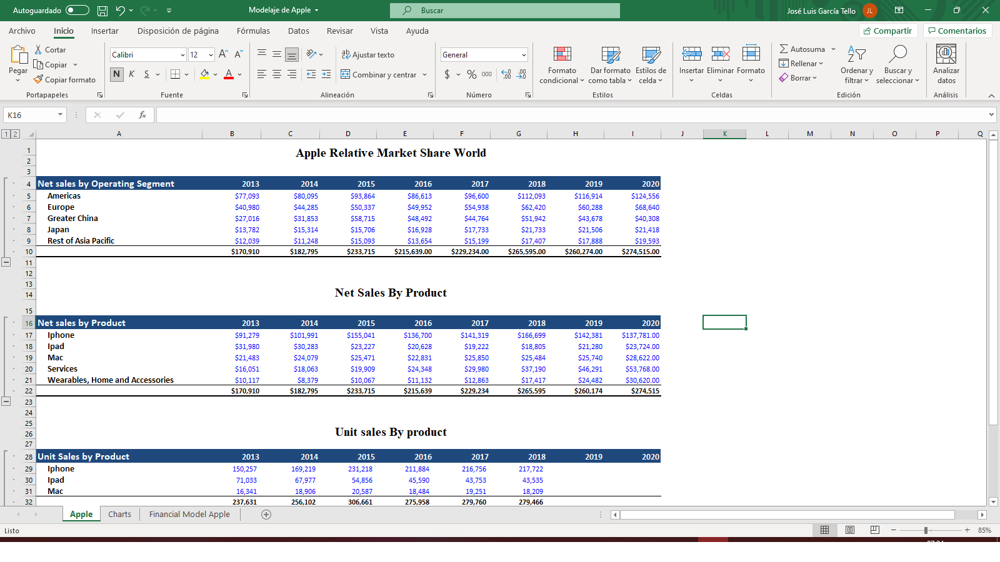
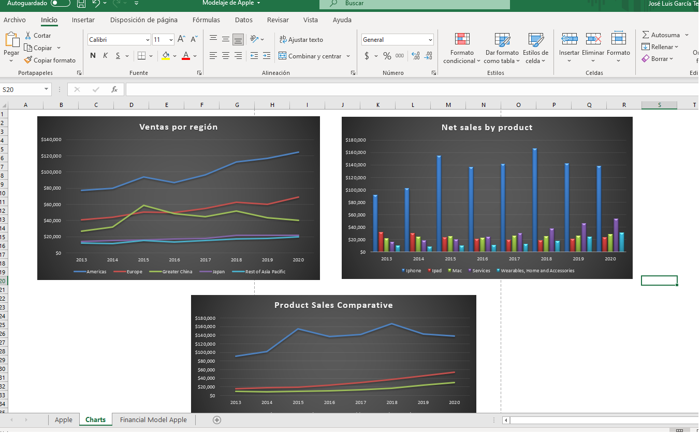
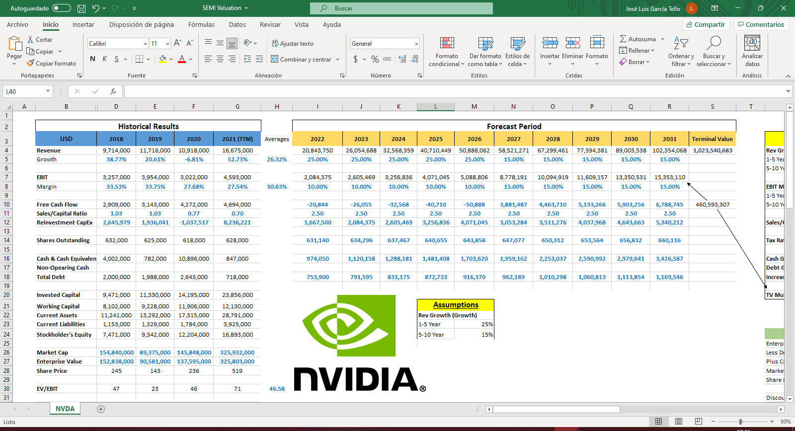
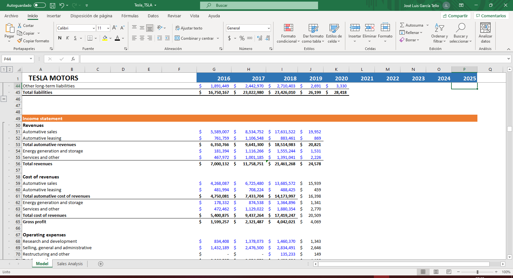
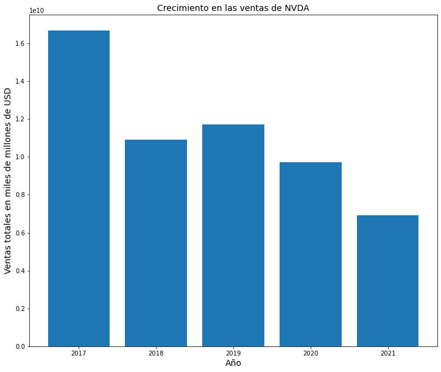
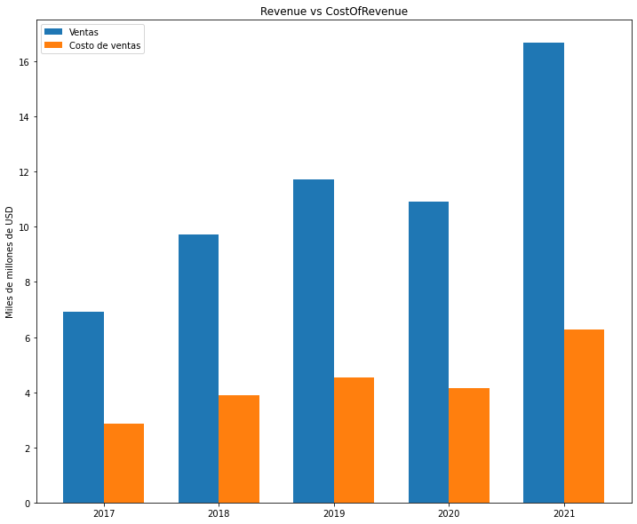

#### ¡Bienvenido de nuevo! 👋  

Este ultimo año estuve experimentando con las finanzas corporativas, en especial con desarrollador/adaptar modelos financieros. Me volví un adicto consciente que detectaba cosas poco sanas y justo una de ellas era el traspasar los datos manualmente a la hora de crear cualquier tipo de analisis. Se el dolor y el amor que podemos experimentar al crear modelos financieros, buscar dentro de un reporte anual (K10) y pasar datos a mano es un proceso lento lleno de fricciones.









 Como ustedes sabran eso es impensable para un desarrollador, por ello decidi experimentar con muchas API's hasta que encontre una [API financiera](https://financialmodelingprep.com/developer/docs) con una clara documentación y que me daba lo que quería; datos de [EDGAR](https://www.sec.gov/edgar/about). En este post aprenderas sobre:

1. Que es un API REST
2. Como se comunican las API REST 
3. Como extraer datos de una API REST 
4. Transformar los datos de JSON de una API a un dataframe de Pandas
5. Como graficar los datos con Matplotlib y Numpy
6. Como guardar los datos dentro de un CSV para que los manipules con en Excel, R u otra herramienta de tu agrado

#### ¿Que es un API REST?

Una API es una interfaz de comunicación. A diferencia de una UI (interfaz de usuario) que permite una comunicación entre persona-computadora, una API conecta computadoras-software entre ellas. Con una API un programador puede construir aplicaciones enteras o simplemente distribuidor los datos que tiene previamente almacenados en una base de datos, si, justo lo que hace la API que veremos en este blog.

API REST es una API que se construyo bajo un diseño de arquitectura llamado REST. REST fue propuesto por Roy Thomas en un paper titulado **Architectural Styles and the Design of Network-based Software Architectures**, y es un estilo de arquitectura que se creo con el fin de definir un conjunto de restricciones para la comunicación en sistemas distribuidos como la WEB. 

Una de las ideas detras de REST es ver a los datos como objetos que puedes llamar, crear o destruir a través de metodos y que son representados en formato JSON, XML o RDF. Algunos de los metodos más usados son los siguientes:

| Metodo | Descripcion |
| ----------- | ----------- |
| GET | Trae informacion  |
| POST | Crea informacion | 
| PUT | Actualiza informacion |
| DELETE | Borra informacion | 

#### ¿Como se comunican las API REST?

Podriamos decir que se comunican a través de protocolos llamados HTTP o Hypertext Transfer Protocol los cuales son protocolos del tipo Request-Response (pedido y respuesta) y cuya funcion principal es establecer una comunicación entre sistemas de la Internet que conforman el World Wide Web (WWW).

Fue creado para actuar como un puente entre los clientes y servidores. Este "puente" tiene metodos definidos que indican acciones *deseadas* por parte de un cliente hacia un recurso especifico. Lo que el recurso represente depende de lo que se implemento en el servidor. Basicamente REST es la manera en que HTTP se debe usar.

#### Como extraer datos de una API REST

Ahora que entendiste lo que es una API REST es hora de empezar a usarlas a favor de nuestro beneficio. Hay 3 reglas que se deben seguir para consumir una API REST.

1. Definir el metodo
2. Definir los parametros
3. Hacer el request

Nuestro metodo sera de tipo GET lo cual es igual a pedirle datos a la API.

Una vez definido el metodo pasamos a definir los parametros que utilizaremos para que la consulta se realice:

1. La llave de la API (la puedes conseguir [creando una cuenta](https://financialmodelingprep.com/register) en el portal de la API) 
2. El ticket con el que se identifica a la empresa dentro de las bolsas de valores
3. Los años que es lo mismo que definir un periodo de tiempo

En esta ocasion haremos un request de datos financieros del Income Statement de NVIDIA con el id/ticket NVDA dentro de un periodo de 5 años.

Empezamos por invocar los paquetes que utilizaremos. En este caso es [requests](https://pypi.org/project/requests/) y JSON.

```python
import requests 
import json
```

Ahora definimos los parametros que es la llave que necesitamos, el ticket y los años.

```python
# DEFINIENDO PARAMETROS #
api_key = 'Ingresa_tu_apikey_aqui'
company = "NVDA"
years = 5
```

Es tiempo de solicitar los datos. **Por cierto, si lo que quieres es el balance Sheet o cash flow solo cambia la parte de income-statement en la URL por balance-sheet o cash-flow.**

```python
# REQUEST GET  con el package Requests.
r = requests.get(f'https://financialmodelingprep.com/api/v3/income-statement/{company}?limit={years}&apikey={api_key}')
data = r.json()
print(data)
# CON ESTO CREAMOS UN OBJETO de datos al cual no le haré print 😅
```

#### Transformando los datos JSON a un DF

Analizar datos de tipo JSON no es recomendable, son dificiles de manipular ya que su proposito principal es enviar y recibir información entre servidores. Por suerte tenemos Pandas, una libreria de Python creada por Wes McKinney cuyo proposito es manipular, transformar y analizar datos y nos ayuda en una tarea critica que es cambiar el formato JSON a DF.

Primero importamos pandas. 

```python
import pandas as pd
```

Y despues escribimos este pedazo de codigo el cual nos permite cambiar el formato.

```python
df = pd.DataFrame(data)
df.info()
```

```
     #   Column                                   Non-Null Count  Dtype  
    ---  ------                                   --------------  -----  
     0   date                                     5 non-null      object 
     1   symbol                                   5 non-null      object 
     2   reportedCurrency                         5 non-null      object 
     3   fillingDate                              5 non-null      object 
     4   acceptedDate                             5 non-null      object 
     5   period                                   5 non-null      object 
     6   revenue                                  5 non-null      int64  
     7   costOfRevenue                            5 non-null      int64  
     8   grossProfit                              5 non-null      int64  
     9   grossProfitRatio                         5 non-null      float64
     10  researchAndDevelopmentExpenses           5 non-null      int64  
     11  generalAndAdministrativeExpenses         5 non-null      float64
     12  sellingAndMarketingExpenses              5 non-null      float64
     13  sellingGeneralAndAdministrativeExpenses  5 non-null      int64  
     14  otherExpenses                            5 non-null      float64
     15  operatingExpenses                        5 non-null      int64  
     16  costAndExpenses                          5 non-null      int64  
     17  interestExpense                          5 non-null      int64  
     18  depreciationAndAmortization              5 non-null      int64  
     19  ebitda                                   5 non-null      int64  
     20  ebitdaratio                              5 non-null      float64
     21  operatingIncome                          5 non-null      int64  
     22  operatingIncomeRatio                     5 non-null      float64
     23  totalOtherIncomeExpensesNet              5 non-null      int64  
     24  incomeBeforeTax                          5 non-null      int64  
     25  incomeBeforeTaxRatio                     5 non-null      float64
     26  incomeTaxExpense                         5 non-null      int64  
     27  netIncome                                5 non-null      int64  
     28  netIncomeRatio                           5 non-null      float64
     29  eps                                      5 non-null      float64
     30  epsdiluted                               5 non-null      float64
     31  weightedAverageShsOut                    5 non-null      int64  
     32  weightedAverageShsOutDil                 5 non-null      int64  
     33  link                                     5 non-null      object 
     34  finalLink                                5 non-null      object 
```

Los datos vienen sin valores nulos. Lo unico que hare es quitar quitar algunas columnas como los ratios y aplicar un SORT. Esto te permitira cambiar el orden del frame a partir de sus fechas ya que si lo graficamos de esta manera los plots te saldran invertidos.

Con esto eliminalos las columnas.

```python
df = df.drop(columns=['reportedCurrency', 
                      'fillingDate', 
                      'acceptedDate', 
                      'period', 
                      'link', 
                      'finalLink', 
                      'symbol', 
                      'grossProfitRatio', 
                      'incomeBeforeTaxRatio', 
                      'netIncomeRatio', 
                      'eps', 
                      'epsdiluted'])
```

Y con el siguient codigo invertimos el orden del frame.

```python
df = df.sort_values("date")
```

#### Graficando los datos

Es hora de hacer algunos plots para mostrarte lo facil que es graficar.

1. Primero cargare las librerias 
2. Despues aplicare una configuración para el tamaño de los plots
3. Por ultimo dividire las columnas de mi interes para que el axis de Y no arroje visualizaciones raras jaja.


```python
import matplotlib.pyplot as plt
import numpy as np
import seaborn as sns
```

```python
### Este codigo establece la anchura y la altura de los plots (bastante util) 
%matplotlib inline
plt.rcParams['figure.figsize'] = (12, 10)
```

Para comparar utilizare dos metricas dentro de un periodo de 5 años:

1. Las ventas de la compañia 
2. Los costes de en los que incurre la compañia para hacer esas ventas 


```python
## Este codigo te permite seleccionar las columnas de tu interes con el proposito
## de dividirlas y mejorar la visualización del plot
df[["revenue", "costOfRevenue"]] = df[["revenue", "costOfRevenue"]] / 1000000000
```


```python
plt.bar(df['date'], df['revenue'])
plt.title('Crecimiento en las ventas de NVDA', fontsize=14)
plt.xlabel('Año', fontsize=14)
plt.ylabel('Ventas totales en miles de millones de USD', fontsize=14)
plt.xticks(df['date'],['2017', '2018', '2019', '2020', '2021'])
plt.show()
```



    

```python
### Localizando los datos

descripcion = ['2017', '2018', '2019', '2020', '2021']
revenue = df["revenue"]
costOfRevenue = df["costOfRevenue"]

### Recorriendo la descripcion

x = np.arange(len(descripcion)) 
width = 0.35  

### Configurando los plots

fig, ax = plt.subplots()
plot1 = ax.bar(x - width/2, revenue, width, label='Ventas')
plot2 = ax.bar(x + width/2, costOfRevenue, width, label='Costo de ventas')

### Añadiendo la descripcion
ax.set_ylabel('Miles de millones de USD')
ax.set_title('Revenue vs CostOfRevenue')
ax.set_xticks(x)
ax.set_xticklabels(descripcion)
ax.legend()


plt.show()
```
    

    

#### Creando un csv

Si lo anterior te parecio dificil, no te preocupes. Siempre hay diferentes maneras de hacer algo, y de hecho, me parece que utilizar Python para este tipo de cosas (visualizar frames tan pequeños) es innecesario. Para eso tenemos Excel.

Con el siguiente pedazo de codigo vas a poder crear un csv con los datos que sacaste del API y con ello poder manipularlos en tu herramienta preferida.

```python
### Al indicar index = False eliminas las enumeraciones de cada fila. 
df.to_csv('NVDA.csv', index = False)
```

Bueno, esto es todo por hoy!

Espero que este proyecto te ayude con tus objetivos profesionales y no profesionales. Si necesitas ayuda siempre puedes mandarme un mensaje a joluistello@gmail.com. 

Un abrazo!